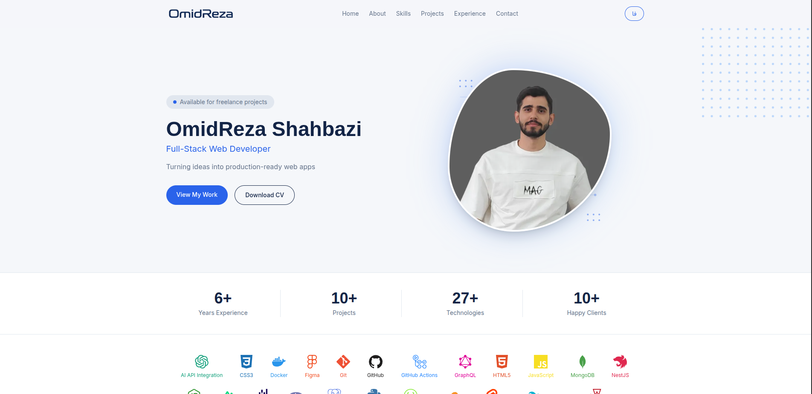

# itzOmidReza — Portfolio

A fast, bilingual (Persian/English) developer portfolio built with [Astro](https://astro.build), featuring full RTL support, type-safe content collections, and a clean navy/blue tech-oriented design system.

🔗 **Live site:** [itzomidreza.ir](https://www.itzomidreza.ir)



---

## Features

- 🌐 **Bilingual (fa/en)** — English as default locale (no prefix), Persian under `/fa/`, with full RTL layout support
- ⚡ **Astro + Server Rendering** — deployed on Vercel with on-demand rendering for the contact API route, static prerendering for content pages
- 📦 **Type-safe content** — projects, experience, skills, and testimonials managed via Astro Content Collections with Zod schemas
- 🎨 **Custom design system** — navy/electric-blue palette, geometric typography (Space Grotesk/Sora + Inter), consistent spacing and radius scale
- ✉️ **Working contact form** — server-side API route powered by [Resend](https://resend.com)
- 🔍 **SEO-ready** — per-page meta tags, Open Graph images, canonical URLs, hreflang alternates, and an auto-generated sitemap
- ♿ **Accessible & motion-aware** — respects `prefers-reduced-motion`, semantic HTML, keyboard-navigable
- 🖼️ **Optimized assets** — `astro:assets` for local images, full favicon/PWA icon set

---

## Tech Stack

| Category | Technology |
|---|---|
| Framework | [Astro](https://astro.build) |
| Styling | [Tailwind CSS v4](https://tailwindcss.com) |
| Language | TypeScript |
| Content | Astro Content Collections (Zod-validated JSON) |
| i18n | `astro:i18n` (built-in) |
| Icons | [astro-icon](https://github.com/natemoo-re/astro-icon) + [Simple Icons](https://simpleicons.org) |
| Fonts | [Vazirmatn](https://github.com/rastikerdar/vazirmatn) (fa) + [Inter](https://rsms.me/inter/) (en) via Fontsource |
| Email | [Resend](https://resend.com) |
| Dates | dayjs + jalaliday (Jalali calendar support for fa) |
| Deployment | [Vercel](https://vercel.com) (`@astrojs/vercel` adapter) |
| Sitemap | `@astrojs/sitemap` |

---

## Project Structure

```
src/
├── assets/            # Local images processed by astro:assets
├── components/        # Astro components (Header, Hero, Footer, Projects, etc.)
├── content/            # Content Collections (data-driven, JSON)
│   ├── experience/     # Work/education timeline entries
│   ├── projects/       # Portfolio projects
│   ├── skills/         # Tech stack & skill levels
│   └── testimonials/    # Client/colleague testimonials
├── i18n/
│   ├── site.ts          # Site-wide content (bio, contact info, socials — localized)
│   ├── ui.ts            # UI string dictionary (nav, buttons, labels)
│   └── utils.ts         # Locale helpers (getLangFromUrl, useTranslations, etc.)
├── layouts/
│   └── Layout.astro     # Base HTML shell, fonts, favicon, scroll behavior
├── lib/
│   └── brand-colors.ts  # Brand color lookup for tech stack icons
├── pages/
│   ├── api/contact.ts   # Server-rendered contact form endpoint
│   ├── fa/                # Persian routes
│   ├── projects/[slug]/  # Project detail pages (en)
│   └── index.astro      # Homepage (en)
└── content.config.ts    # Content Collection schemas (Zod)

public/
├── icons/              # Favicon set (ico, png, apple-touch-icon, manifest icons)
├── og/                 # Open Graph images (per locale)
├── logo.png / logo-white.png
└── site.webmanifest
```

---

## Getting Started

### Prerequisites

- Node.js `>=22.12.0` (Node 24 recommended to match the Vercel runtime)
- npm (or your preferred package manager)

### Installation

```bash
git clone https://github.com/itzOmidReza/itzOmidReza.git
cd itzOmidReza
npm install
```

### Environment Variables

Copy the example env file and fill in your own values:

```bash
cp .env.Example .env
```

| Variable | Description |
|---|---|
| `RESEND_API_KEY` | API key from [resend.com](https://resend.com) for the contact form |

> The contact form (`src/pages/api/contact.ts`) requires this key to send emails. Without it, the API route will fail in development and in production.

### Development

```bash
npm run dev
```

Visit `http://localhost:4321`.

### Build

```bash
npm run build
```

### Preview (static UI only)

```bash
npm run preview
```

> ⚠️ Because this project uses `output: "server"` with the Vercel adapter, `astro preview` won't fully replicate serverless behavior (like the `/api/contact` route). For an accurate local test of the full deployment, use:
> ```bash
> npx vercel dev
> ```

---

## Content Management

All dynamic content lives in `src/content/` as JSON files validated against Zod schemas (`src/content.config.ts`). No CMS required — add or edit a `.json` file and the site rebuilds with type safety.

**Example: adding a new project**

```json
// src/content/projects/my-new-project.json
{
  "title": "My New Project",
  "description": {
    "fa": "توضیح پروژه به فارسی",
    "en": "Project description in English"
  },
  "images": ["https://example.com/screenshot.png"],
  "tech": ["Astro", "TypeScript"],
  "category": "Full-Stack",
  "link": "https://github.com/itzOmidReza/my-new-project",
  "featured": false,
  "order": 11
}
```

The same pattern applies to `experience/`, `skills/`, and `testimonials/` — check `content.config.ts` for the exact schema of each collection.

---

## Internationalization

- **Default locale:** English (`en`), served without a URL prefix (`/`)
- **Secondary locale:** Persian (`fa`), served under `/fa/`
- Static UI strings live in `src/i18n/ui.ts`
- Dynamic content (bio, project descriptions, etc.) uses `{ fa, en }` localized objects directly in content files and `src/i18n/site.ts`
- RTL is applied automatically via `dir="rtl"` on `<html>` when the locale is `fa`, using Tailwind logical properties (`ps-*`, `pe-*`, `text-start`) throughout

---

## Deployment

This project is configured for [Vercel](https://vercel.com) via `@astrojs/vercel`.

1. Push the repository to GitHub
2. Import the project in Vercel
3. Add environment variables in **Project Settings → Environment Variables** (do **not** rely on committing `.env` — it's gitignored intentionally)
4. Deploy — Vercel will run `npm run build` automatically

---

## License

The source code in this repository is licensed under the [MIT License](./LICENSE).

The content of this portfolio — including name, biography, project descriptions, images, and personal branding — is © 2026 OmidReza Shahbazi. All rights reserved. Feel free to use the code and structure as a template for your own portfolio, but please don't reuse the personal content as-is.

---

## Contact

- **Website:** [itzomidreza.ir](https://www.itzomidreza.ir)
- **Email:** itzOmidReza@gmail.com
- **GitHub:** [@itzOmidReza](https://github.com/itzOmidReza)
- **LinkedIn:** [omidrezashahbazi](https://www.linkedin.com/in/omidrezashahbazi/)
- **Telegram:** [@itzOmidReza](https://t.me/itzOmidReza)